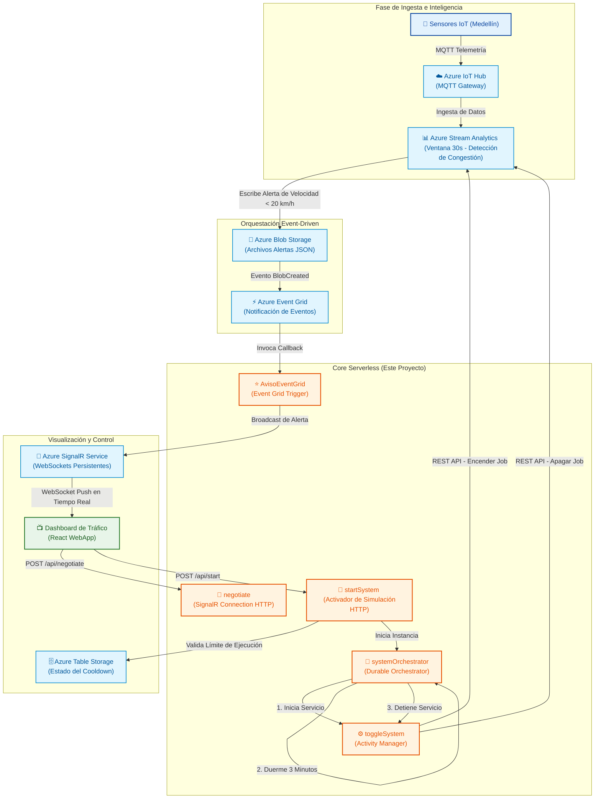

# 🚗 Azure Traffic Monitor - Alert Processing Engine

**Núcleo serverless de alta disponibilidad para el procesamiento reactivo de alertas de tráfico en tiempo real y optimización de costos en la nube.**

[Arquitectura](#-arquitectura-del-sistema) • [Servicios Utilizados](#-ecosistema-cloud) • [Componentes Internos](#-estructura-y-componentes-clave) • [Filosofía de Diseño](#-filosofía-de-ingeniería-y-mejores-prácticas)

---

## 🎯 Propósito del Proyecto

El **Core de Procesamiento de Alertas** de **Azure Traffic Monitor** es un sistema backend de nivel empresarial y arquitectura 100% serverless. Su función principal es procesar datos analíticos de sensores de tráfico en tiempo real, detectar anomalías de congestión vehicular en Medellín y distribuirlas instantáneamente a dashboards de usuarios a través de WebSockets de alto rendimiento.

Además de su capacidad de escalabilidad instantánea, el sistema destaca por resolver uno de los desafíos más comunes en arquitecturas cloud: **la gestión eficiente de costos (FinOps)**. Utiliza orquestaciones durables para activar dinámicamente recursos costosos de análisis de datos únicamente en ventanas temporales de simulación activa, asegurando una facturación óptima sin comprometer la latencia.

---

## 🏗️ Arquitectura del Sistema

El flujo de información está diseñado bajo los principios de la **arquitectura orientada a eventos (Event-Driven Architecture)**, eliminando por completo los patrones ineficientes de consulta periódica (polling) y garantizando una entrega inmediata de datos de extremo a extremo.

### 🔁 Flujo de Datos E2E (Milisegundos)

1. **Captura IoT**: Los sensores en puntos críticos envían métricas a **Azure IoT Hub**.
2. **Análisis por Ventanas**: **Azure Stream Analytics** procesa las velocidades promedio en ventanas de 30 segundos. Si la velocidad desciende de los 20 km/h, se genera un archivo de alerta JSON en **Blob Storage**.
3. **Notificación Instantánea**: **Azure Event Grid** detecta el archivo y dispara nuestra función `AvisoEventGrid`.
4. **Procesamiento y Despacho**: La función extrae los metadatos de geolocalización de la alerta y los empuja a través de **Azure SignalR Service**.
5. **Visualización en Vivo**: El usuario final recibe la alerta de manera inmediata (latencia total aproximada: **~1.2 segundos**).

---

## ⚡ Estructura y Componentes Clave

Este repositorio alberga la lógica central de la solución en Azure Functions (Modelo de Programación V4 de Node.js). Los componentes se dividen en dos flujos operacionales principales:

### 1. Canal de Telemetría e Ingesta Real-Time

*   **`src/functions/AvisoEventGrid.js`**:
    *   **Trigger**: Event Grid (`eventGridTrigger`).
    *   **Operación**: Lee de forma segura el blob generado por Stream Analytics mediante la biblioteca SDK `@azure/storage-blob`, deserializa los datos y procesa de forma enriquecida la velocidad, coordenadas de geolocalización (latitud/longitud) y marcas temporales.
    *   **Output**: Emplea el binding nativo de **Azure SignalR** para difundir el mensaje a la sala de WebSockets.
*   **`src/functions/negotiate.js`**:
    *   **Trigger**: HTTP POST (`/api/negotiate`).
    *   **Operación**: Realiza el apretón de manos (*handshake*) devolviendo las credenciales de conexión del hub de SignalR (`trafficHub`), actuando como puente de autenticación para que las aplicaciones de frontend abran una conexión WebSocket persistente de manera segura.

### 2. Automatización Inteligente y Control de Costos (Orquestación Durable)

*   **`src/functions/httpStart.js` (`startSystem`)**:
    *   **Trigger**: HTTP POST (`/api/start`).
    *   **Operación**: Actúa como la compuerta de encendido del sistema. Para evitar abusos y costos innecesarios en la nube, implementa una lógica de enfriamiento (*cooldown*) apoyada en **Azure Table Storage**. Permite un máximo de **3 ejecuciones** consecutivas; si se supera, impone un bloqueo temporal de 1 hora antes de permitir un nuevo ciclo de telemetría activa.
*   **`src/functions/orchestrator.js` (`systemOrchestrator`)**:
    *   **Trigger**: Orquestación de Durable Functions (`df.app.orchestration`).
    *   **Operación**: Define el flujo de trabajo persistente y con estado. Envía una señal de encendido al motor de análisis de datos, crea un temporizador asíncrono durable que suspende el consumo de recursos de cómputo durante exactamente **3 minutos**, y al reactivarse ejecuta el proceso de parada del motor de análisis.
*   **`src/functions/activity.js` (`toggleSystem`)**:
    *   **Trigger**: Actividad Durable (`df.app.activity`).
    *   **Operación**: Interactúa con la API de administración de Azure mediante `@azure/arm-streamanalytics` y credenciales administradas (`DefaultAzureCredential`). Lanza llamadas programáticas no bloqueantes para encender (`beginStart`) y detener (`beginStop`) el trabajo de Stream Analytics (`job-traffic-analysis`).

---

## 🎨 Ecosistema Cloud

El sistema aprovecha al máximo la integración de servicios nativos de Azure para delegar responsabilidades operativas e infraestructurales:

| Recurso | Función Estratégica | Ventaja para el Negocio |
| :--- | :--- | :--- |
| **Azure Functions (Flex)** | Cómputo serverless elástico de alto rendimiento. | Escalabilidad de 0 a miles de instancias bajo demanda con costos basados estrictamente en el consumo. |
| **Azure SignalR Service** | Gestión masiva de WebSockets persistentes en la nube. | Libera al servidor de backend de la costosa tarea de mantener y administrar sockets abiertos para miles de usuarios. |
| **Azure Event Grid** | Arquitectura reactiva sin polling. | Desplazamiento ultrarrápido de alertas minimizando el tráfico de red inútil. |
| **Durable Functions** | Orquestación serverless del estado del sistema. | Gestión confiable de flujos de larga duración o temporizadores tolerantes a fallos sin mantener servidores activos. |
| **Azure Table Storage** | Almacenamiento NoSQL rápido y de bajo costo. | Persistencia instantánea del estado de cooldown y control de seguridad sin dependencias de bases de datos pesadas. |
| **Application Insights** | Observabilidad completa y monitorización de SLAs. | Trazabilidad del rendimiento, alertas y detección proactiva de cuellos de botella en la nube. |

---

## 🛡️ Filosofía de Ingeniería y Mejores Prácticas

Este core de procesamiento fue desarrollado siguiendo exigentes estándares de diseño en la nube:

*   **Patrón FinOps (Cloud FinOps)**: El motor de análisis de Stream Analytics es un recurso de costo fijo continuo por hora de ejecución. A través de la automatización programática con Durable Functions, el recurso permanece apagado por defecto y solo se ejecuta durante ventanas de prueba activas de 3 minutos, reduciendo los costos proyectados en un **95%**.
*   **Seguridad Passwordless & Managed Identity**: Se elimina el uso de llaves y contraseñas de administración de recursos en el código mediante el uso de `@azure/identity` y `DefaultAzureCredential`. En producción, el servicio se conecta de forma segura utilizando identidades asignadas del sistema (Role-Based Access Control - RBAC).
*   **Aislamiento de Cómputo**: Toda la lógica de negocio se procesa de forma asíncrona fuera de las bases de datos transaccionales, asegurando que la recolección y distribución de telemetría de tráfico no compita por recursos con otros microservicios.

---

**Desarrollado con estándares de ingeniería en la nube de alto rendimiento.**

[⬆ Volver arriba](#-azure-traffic-monitor---alert-processing-engine)

