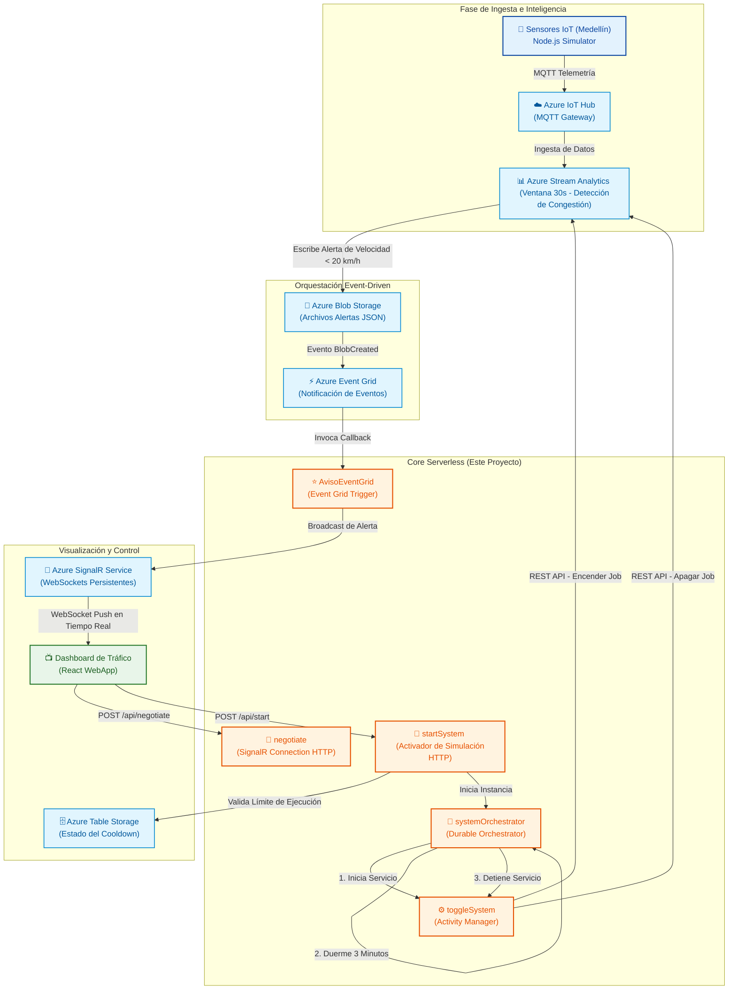

# 🚗 Azure Traffic Monitor - Alert Processing Engine

**Núcleo serverless de alta disponibilidad para el procesamiento reactivo de alertas de tráfico en tiempo real y optimización de costos en la nube.**

[Propósito](#-propósito-del-proyecto) • [Simulador IoT](https://github.com/owenunda/az-traffic-monitor) • [Arquitectura del Sistema](#-arquitectura-del-sistema) • [Pilares y Beneficios](#-pilares-tecnológicos-y-ventajas-clave) • [Ecosistema Paso a Paso](#-componentes-de-la-arquitectura-el-paso-a-paso) • [Estructura Clave](#-estructura-y-componentes-clave)

---

## 🎯 Propósito del Proyecto

El **Core de Procesamiento de Alertas** de **Azure Traffic Monitor** es un sistema backend de nivel empresarial y arquitectura 100% serverless. Su función principal es procesar datos analíticos de sensores de tráfico en tiempo real, detectar anomalías de congestión vehicular en Medellín y distribuirlas instantáneamente a dashboards de usuarios a través de WebSockets de alto rendimiento.

Además de su capacidad de escalabilidad instantánea, el sistema destaca por resolver uno de los desafíos más comunes en arquitecturas cloud: **la gestión eficiente de costos (FinOps)**. Utiliza orquestaciones durables para activar dinámicamente recursos costosos de análisis de datos únicamente en ventanas temporales de simulación activa, asegurando una facturación óptima sin comprometer la latencia.

> [!TIP]
> 🔌 **Simulador IoT Activo**: Toda la generación de telemetría y simulación física de sensores que alimenta esta arquitectura está alojada en su propio repositorio dedicado. Puedes explorar, configurar y arrancar la simulación desde el **[Repositorio del Simulador de Tráfico (az-traffic-monitor)](https://github.com/owenunda/az-traffic-monitor)**.

---

## 🚀 Pilares Tecnológicos y Ventajas Clave

La arquitectura está construida sobre tres pilares fundamentales que garantizan un rendimiento óptimo de nivel empresarial y una operación en la nube sumamente eficiente:

*   **📈 Escalabilidad Infinita**: *El sistema puede pasar de 1 sensor a 10,000 sensores sin cambiar una sola línea de código*, gracias a la infraestructura elástica de auto-escala de Azure (IoT Hub, Stream Analytics y Azure Functions).
*   **💰 Eficiencia de Costos (Cloud FinOps)**: *Al usar un modelo basado puramente en eventos (Event Grid + Functions), solo pagamos por los milisegundos exactos que toma procesar una alerta.* Si no hay tráfico ni eventos activos en la red, el costo de cómputo en la nube es **literalmente cero**.
*   **⚡ Baja Latencia**: *Desde que el sensor detecta una velocidad baja en las calles de Medellín hasta que aparece el cuadro rojo de congestión en pantalla, pasan solo un par de segundos.* Esta velocidad extrema permite tomar decisiones de tráfico y desvíos de manera inmediata.

---

## 🏗️ Arquitectura del Sistema

El flujo de información está diseñado bajo los principios de la **arquitectura orientada a eventos (Event-Driven Architecture)**, eliminando por completo los patrones ineficientes de consulta periódica (polling) y garantizando una entrega inmediata de datos de extremo a extremo.

---

## ⚙️ Componentes de la Arquitectura (El Paso a Paso)

El flujo completo de extremo a extremo (E2E) está compuesto por siete piezas clave que actúan de manera coordinada y reactiva:

### 1. 📡 Generación de Datos (El Sensor)
*   **Qué usamos**: Un script en **Node.js** con el **SDK de Azure IoT**.
*   **Explicación**: Simulamos un sensor físico ubicado en Medellín. Este sensor envía mensajes en formato JSON que contienen el ID del sensor, la velocidad capturada y la ubicación geográfica (latitud y longitud).
*   **Punto clave**: Usamos el protocolo **MQTT**, que es el estándar de la industria para dispositivos IoT porque es ligero y consume muy poca batería.
*   **Enlace al código**: Visita el [repositorio de az-traffic-monitor](https://github.com/owenunda/az-traffic-monitor) para ver el funcionamiento interno del sensor.

### 2. 🚪 Ingesta de Datos (La Puerta de Entrada)
*   **Qué usamos**: **Azure IoT Hub**.
*   **Explicación**: Es nuestro punto central de comunicación segura en la nube. IoT Hub es capaz de recibir de forma segura millones de eventos por segundo, absorbiendo los mensajes del sensor y dejándolos inmediatamente disponibles para el análisis en tránsito.

### 3. 🧠 Procesamiento en Tiempo Real (El Cerebro)
*   **Qué usamos**: **Azure Stream Analytics**.
*   **Explicación**: Aquí es donde ocurre la "inteligencia activa". Stream Analytics analiza los datos mientras se mueven (en vuelo) usando una ventana de tiempo (ej. 30 segundos) para calcular el promedio de velocidad.
*   **Detección**: Si el promedio de velocidad detectado es bajo (menor a 20 km/h), el sistema identifica una congestión crítica y escribe de inmediato un reporte estructurado en el Blob Storage.

### 4. 💾 Almacenamiento Intermedio (La Bitácora)
*   **Qué usamos**: **Azure Blob Storage**.
*   **Explicación**: Un almacenamiento de objetos en la nube masivo, escalable y sumamente económico. Funciona como nuestra bitácora, donde se guardan los archivos JSON con las alertas individuales de tráfico lento generadas por el cerebro.

### 5. ⚡ Orquestación de Eventos (El Timbre)
*   **Qué usamos**: **Azure Event Grid**.
*   **Explicación**: Este es el "pegamento" reactivo de la arquitectura. En lugar de que nuestra función de procesamiento esté revisando el Storage de forma constante y desperdiciando recursos (patrón polling), Event Grid envía una notificación instantánea a la función en milisegundos *únicamente* cuando se crea un archivo nuevo.
*   **Concepto**: Esto implementa una arquitectura 100% reactiva y asíncrona (*Serverless & Event-Driven*).

### 6. ⚙️ Lógica de Negocio (El Procesador)
*   **Qué usamos**: **Azure Functions** (Plan Flex Consumption / Node.js V4).
*   **Explicación**: Código que se ejecuta bajo demanda en milisegundos. Nuestra función procesadora realiza tres tareas críticas al despertarse:
    1. Se activa automáticamente con el aviso inmediato de Event Grid.
    2. Lee únicamente el último reporte del Storage para garantizar consistencia y evitar procesamientos duplicados.
    3. Procesa y despacha el dato formateado al servicio de mensajería instantánea en tiempo real.

### 7. 💬 Comunicación en Tiempo Real (El Mensajero)
*   **Qué usamos**: **Azure SignalR Service**.
*   **Explicación**: Es la tecnología que permite que la web se actualice de forma instantánea sin la intervención del usuario. Mantiene un canal persistente y bidireccional (WebSocket) entre Azure y tu navegador. Cuando la función procesadora tiene una alerta, SignalR la "empuja" de inmediato al Dashboard en milisegundos sin necesidad de refrescar la página.

---

## ⚡ Estructura y Componentes Clave

Este repositorio alberga la lógica central de la solución en Azure Functions (Modelo de Programación V4 de Node.js). Los componentes se dividen en dos flujos operacionales principales:

### 1. Canal de Telemetría e Ingesta Real-Time
*   **`src/functions/AvisoEventGrid.js`**:
    *   **Trigger**: Event Grid (`eventGridTrigger`).
    *   **Operación**: Lee de forma segura el blob generado por Stream Analytics mediante la biblioteca SDK `@azure/storage-blob`, deserializa los datos y procesa de forma enriquecida la velocidad, coordenadas de geolocalización (latitud/longitud) y marcas temporales.
    *   **Output**: Emplea el binding nativo de **Azure SignalR** para difundir el mensaje a la sala de WebSockets.
*   **`src/functions/negotiate.js`**:
    *   **Trigger**: HTTP POST (`/api/negotiate`).
    *   **Operación**: Realiza el apretón de manos (*handshake*) devolviendo las credenciales de conexión del hub de SignalR (`trafficHub`), actuando como puente de autenticación para que las aplicaciones de frontend abran una conexión WebSocket persistente de manera segura.

### 2. Automatización Inteligente y Control de Costos (Orquestación Durable)
*   **`src/functions/httpStart.js` (`startSystem`)**:
    *   **Trigger**: HTTP POST (`/api/start`).
    *   **Operación**: Actúa como la compuerta de encendido del sistema. Para evitar abusos y costos innecesarios en la nube, implementa una lógica de enfriamiento (*cooldown*) apoyada en **Azure Table Storage**. Permite un máximo de **3 ejecuciones** consecutivas; si se supera, impone un bloqueo temporal de 1 hora antes de permitir un nuevo ciclo de telemetría activa.
*   **`src/functions/orchestrator.js` (`systemOrchestrator`)**:
    *   **Trigger**: Orquestación de Durable Functions (`df.app.orchestration`).
    *   **Operación**: Define el flujo de trabajo persistente y con estado. Envía una señal de encendido al motor de análisis de datos, crea un temporizador asíncrono durable que suspende el consumo de recursos de cómputo durante exactamente **3 minutos**, y al reactivarse ejecuta el proceso de parada del motor de análisis.
*   **`src/functions/activity.js` (`toggleSystem`)**:
    *   **Trigger**: Actividad Durable (`df.app.activity`).
    *   **Operación**: Interactúa con la API de administración de Azure mediante `@azure/arm-streamanalytics` y credenciales administradas (`DefaultAzureCredential`). Lanza llamadas programáticas no bloqueantes para encender (`beginStart`) y detener (`beginStop`) el trabajo de Stream Analytics (`job-traffic-analysis`).

---

## 🎨 Ecosistema Cloud

El sistema aprovecha al máximo la integración de servicios nativos de Azure para delegar responsabilidades operativas e infraestructurales:

| Recurso | Función Estratégica | Ventaja para el Negocio |
| :--- | :--- | :--- |
| **Azure Functions (Flex)** | Cómputo serverless elástico de alto rendimiento. | Escalabilidad de 0 a miles de instancias bajo demanda con costos basados estrictamente en el consumo. |
| **Azure SignalR Service** | Gestión masiva de WebSockets persistentes en la nube. | Libera al servidor de backend de la costosa tarea de mantener y administrar sockets abiertos para miles de usuarios. |
| **Azure Event Grid** | Arquitectura reactiva sin polling. | Desplazamiento ultrarrápido de alertas minimizando el tráfico de red inútil. |
| **Durable Functions** | Orquestación serverless del estado del sistema. | Gestión confiable de flujos de larga duración o temporizadores tolerantes a fallos sin mantener servidores activos. |
| **Azure Table Storage** | Almacenamiento NoSQL rápido y de bajo costo. | Persistencia instantánea del estado de cooldown y control de seguridad sin dependencias de bases de datos pesadas. |
| **Application Insights** | Observabilidad completa y monitorización de SLAs. | Trazabilidad del rendimiento, alertas y detección proactiva de cuellos de botella en la nube. |

---

## 🛡️ Filosofía de Ingeniería y Mejores Prácticas

Este core de procesamiento fue desarrollado siguiendo exigentes estándares de diseño en la nube:

*   **Patrón FinOps (Cloud FinOps)**: El motor de análisis de Stream Analytics es un recurso de costo fijo continuo por hora de ejecución. A través de la automatización programática con Durable Functions, el recurso permanece apagado por defecto y solo se ejecuta durante ventanas de prueba activas de 3 minutos, reduciendo los costos proyectados en un **95%**.
*   **Seguridad Passwordless & Managed Identity**: Se elimina el uso de llaves y contraseñas de administración de recursos en el código mediante el uso de `@azure/identity` y `DefaultAzureCredential`. En producción, el servicio se conecta de forma segura utilizando identidades asignadas del sistema (Role-Based Access Control - RBAC).
*   **Aislamiento de Cómputo**: Toda la lógica de negocio se procesa de forma asíncrona fuera de las bases de datos transaccionales, asegurando que la recolección y distribución de telemetría de tráfico no compita por recursos con otros microservicios.

---

**Desarrollado con estándares de ingeniería en la nube de alto rendimiento.**

[⬆ Volver arriba](#-azure-traffic-monitor---alert-processing-engine)

